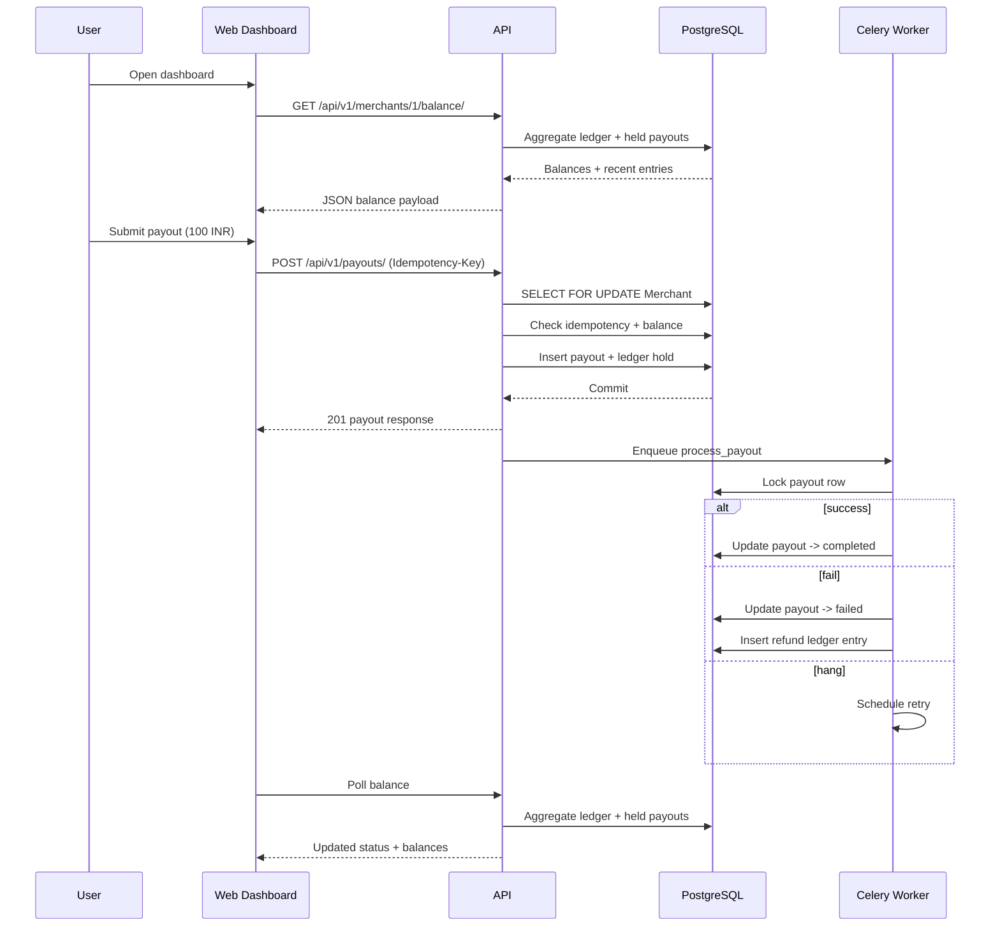
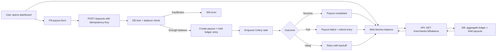
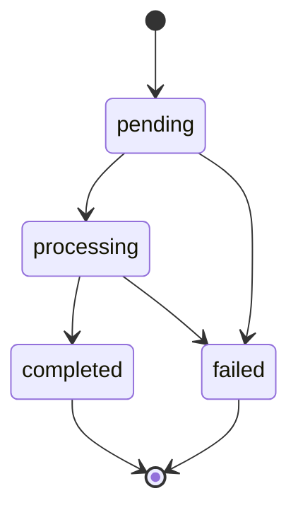

# EXPLAINER

## 1. The Ledger

I never store a “current balance” field. The balance is always computed from ledger rows in the database, using a single aggregate query:

```python
LedgerEntry.objects.filter(merchant=merchant).aggregate(
    total=Coalesce(Sum("amount_paise"), 0)
)["total"]
```

Why I chose this:

- Credits and debits are immutable events. If something goes wrong later, the history still tells the truth.
- No balance drift. A stored balance can get out of sync if a write fails or two writes race. A derived balance cannot.
- All money is stored as integer paise (BigIntegerField). No floats, no rounding surprises.

Held balance is computed separately from payouts in pending/processing:

```python
Payout.objects.filter(
    merchant=merchant,
    status__in=[Payout.Status.PENDING, Payout.Status.PROCESSING],
).aggregate(total=Coalesce(Sum("amount_paise"), 0))["total"]
```

That keeps “available” and “held” consistent and audit-friendly.

## 2. The Lock

The overdraft race (two payouts at the same time) is prevented with a row-level lock:

```python
with transaction.atomic():
    merchant = (
        Merchant.objects.select_for_update()
        .filter(id=merchant_id)
        .first()
    )
```

That `select_for_update()` makes PostgreSQL lock that merchant row. If two payout requests hit together, the second one waits until the first finishes. Only one can pass “check balance → create payout → create hold entry” at a time. That is the primitive that keeps money safe.

## 3. The Idempotency

Workflow:

- Client sends `Idempotency-Key` header (UUID).
- I store that key per merchant in the `IdempotencyKey` table with the response body.
- If the same key is seen again within 24 hours, I return the stored response instead of creating a new payout.

Lookup happens inside the same DB transaction and under the merchant lock:

```python
existing_key = (
    IdempotencyKey.objects.select_for_update()
    .filter(merchant=merchant, key=idempotency_uuid)
    .first()
)
```

If request #2 arrives while request #1 is still running, it blocks on the same merchant row lock. When the first commits, the second reads the idempotency record and replays the exact response (no duplicate payout).

If a key is older than 24 hours, it is treated as expired and deleted, so it can be reused cleanly.

## 4. The State Machine

I explicitly block illegal status transitions in `Payout.save()` by comparing the previous status with the new one:

```python
if self.pk:
    previous = Payout.objects.only("status").get(pk=self.pk)
    if self.status != previous.status:
        valid_targets = self.VALID_STATUS_TRANSITIONS.get(previous.status, set())
        if self.status not in valid_targets:
            raise ValidationError(
                f"Illegal status transition {previous.status} -> {self.status}"
            )
```

So `failed -> completed` or `completed -> pending` will raise a ValidationError, and only legal forward transitions are allowed.

## 5. The AI Audit

One subtle issue I caught in an early AI suggestion:

- The AI draft checked the balance **before** taking the lock.
- That creates a classic check-then-act race: two concurrent requests could both see sufficient balance and both debit.

What I changed:

- The merchant row lock happens first.
- The balance check, payout creation, and ledger hold entry are all done inside the same `transaction.atomic()` block.

Result:

- Exactly one payout succeeds when two concurrent requests exceed balance.
- The concurrency test proves this behavior (one 201, one 400).

## 6. Example (User Perspective)

Scenario: A merchant with 3,500 INR available balance requests a 100 INR payout.

1. The merchant opens the dashboard and sees available balance, held balance, and recent ledger entries.
2. They fill Merchant ID = 1, Amount = 100, Bank Account ID = bank_acc_demo_001 and click Submit.
3. The UI sends `POST /api/v1/payouts/` with header `Idempotency-Key: <uuid>`.
4. The API responds with a payout record in `pending` state.
5. The dashboard keeps polling every 8 seconds and the payout status updates to `processing`, then either `completed` or `failed`.
6. If it fails, the held amount returns to available balance and a refund ledger entry appears.
7. If the user hits submit twice (same idempotency key), they get the exact same response and no duplicate payout is created.

## 7. Example (Technical Flow)

Here is the same flow, step-by-step in the backend:

1. Request validation
    - Validate `Idempotency-Key` UUID.
    - Validate merchant_id, amount_paise, and bank_account_id.

2. Lock + idempotency check (single transaction)
    - `select_for_update()` on the Merchant row.
    - Check IdempotencyKey table for the same key.
    - If found (within 24h), return stored response immediately.

3. Balance check and hold
    - Compute available balance from ledger aggregation in the DB.
    - If insufficient, return 400.
    - Create a Payout row in `pending`.
    - Create a debit LedgerEntry to hold funds.
    - Store response body in IdempotencyKey.

4. Background processing
    - Celery task moves payout to `processing`.
    - Simulates settlement outcome: 70% success, 20% fail, 10% hang.
    - On success: set `completed`.
    - On failure: set `failed` and create credit ledger entry to refund.

5. Retry logic
    - If stuck in `processing` for >30s, retry with exponential backoff.
    - Max 3 attempts; then fail + refund.

## 8. Project File Map (What each key file does)

Backend (Django + DRF)

- apps/api/core/settings.py
    - Central Django settings.
    - Parses DATABASE_URL into Django DB config.
    - CORS configuration (allowed origins + idempotency header).
    - Celery config uses REDIS_URL.

- apps/api/core/urls.py
    - Root URL router.
    - Mounts payouts API at /api/v1/.

- apps/api/core/celery.py and apps/api/core/__init__.py
    - Celery app bootstrap and autodiscover tasks.
    - __init__ exposes celery_app so Django loads it.

- apps/api/payouts/models.py
    - Core data model: Merchant, LedgerEntry, Payout, IdempotencyKey.
    - Ledger entries are immutable credits/debits in paise.
    - Payout state machine rules are enforced in Payout.save().

- apps/api/payouts/views.py
    - POST /api/v1/payouts/ creates payout with idempotency + balance hold.
    - GET /api/v1/merchants/<id>/balance/ returns balance + ledger entries.
    - Uses transaction.atomic + select_for_update to prevent race conditions.

- apps/api/payouts/tasks.py
    - Background payout processor.
    - Simulates success/fail/hang.
    - Retries stuck payouts with exponential backoff and refunds on failure.

- apps/api/payouts/urls.py
    - API route definitions for payouts and balance endpoints.

- apps/api/payouts/tests.py
    - Idempotency test: same key returns same response, no duplicate payout.
    - Concurrency test: two simultaneous payouts, only one succeeds.

- apps/api/seed.py
    - Script to seed 3 demo merchants and ledger entries.

Frontend (Next.js)

- apps/web/app/page.tsx
    - Merchant dashboard UI.
    - Calls API for balance, submits payouts, shows live status table.
    - Polls balance every 8 seconds.

- apps/web/app/layout.tsx
    - App shell and theme provider.

- apps/web/next.config.mjs
    - CSP and security headers, plus workspace package transpile config.

- apps/web/.env.local
    - Frontend API base URL for local dev.

## 9. Deep Dive: Balance Integrity and Holds

I split money into two concepts:

- Available balance = sum of ledger entries (credits + debits).
- Held balance = sum of payouts that are pending or processing.

Why this matters:

- Available is the real spendable value. It only changes when the ledger changes.
- Held is a safety view of money that is already earmarked for a payout.
- If a payout fails, I write a compensating credit ledger entry, so the ledger tells the full story.

This makes audits easy because the numbers are derived from immutable facts, not mutable totals.

## 10. Deep Dive: Concurrency Timeline

Two payout requests for the same merchant arrive at the same time:

1. Request A takes the merchant row lock.
2. Request B waits on the lock.
3. Request A checks balance, creates payout, writes hold ledger entry, commits.
4. Request B acquires the lock after A commits.
5. Request B re-computes balance and sees the updated ledger.
6. If balance is now insufficient, B cleanly returns 400.

The important point: I never read the balance without the lock. That prevents “double spend” races.

## 11. Deep Dive: Idempotency Edge Cases

Common real-world failures I covered:

- Client retries after a timeout: the second call returns the exact same response body.
- Duplicate network retries with same key: no duplicate payout row is created.
- Key reuse after 24 hours: the stored key is expired and removed, so it can be safely reused.

This is why I store the response payload itself in `IdempotencyKey.response_body`.

## 12. Deep Dive: Processing + Retry Logic

Processing logic deliberately simulates real payout behavior:

- 70% success -> payout completes.
- 20% fail -> payout fails and funds are refunded.
- 10% hang -> payout stays in processing and is retried later.

Retry details:

- If a payout has been processing for >30 seconds, it is considered stuck.
- Retries use exponential backoff: 2, 4, 8 seconds (max 3 attempts).
- After 3 attempts, the payout is marked failed and a refund ledger entry is written.

This ensures processing can recover without manually touching balances.

## 13. User Flow Diagram (UML-style)



## 14. User Flow Diagram (Flowchart)



## 15. State Diagram (Payout Status)


